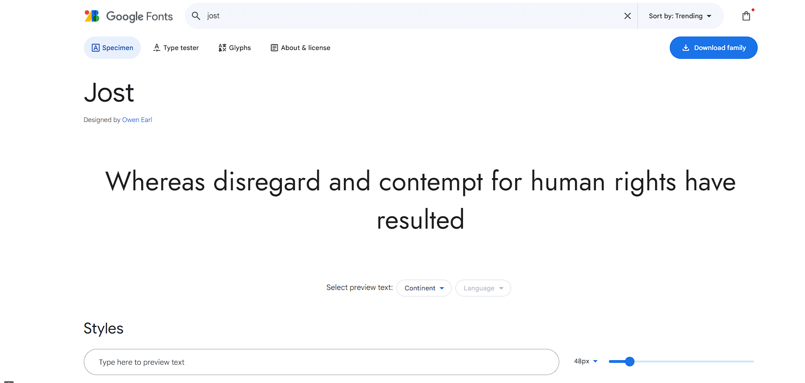

Quill
Project Overview
Quill is an imagined eCommerce platform designed for book sales, utilizing Django, Python, JavaScript, and Bootstrap 4. It operates as a Business to Consumer (B2C) online book retailer.

Created by Akadiri Oluwagbemi

This image of the final website, generated via Techsini, showcases the site across various screen sizes. The live site is accessible here.

Purpose
The 'Quill' application serves as a fictional online extension of a physical bookshop, aimed at expanding customer reach. Its design is intended to encourage users to browse and make purchases.

Business Owner's Goals
The goal for the business owner is to establish a profitable online presence for their physical bookshop, thereby expanding their customer base. This involves creating an intuitive, robust, visually appealing website with a secure and simple payment system. The owner also seeks to manage the product offerings securely, with the ability to add, edit, or delete items through an interactive front-end.

User/Customer's Goals
Quill's customers want to purchase books. They should immediately grasp the site's purpose upon arrival, navigate it intuitively, view all products, and click on any product for more details, ultimately making secure purchases. Users may also wish to register to create a user profile, log in and out of their accounts, view and edit personal data securely, and review their purchase history. Registered users in Ireland can enjoy free delivery. Customer actions are met with interactive front-end feedback confirming successful or unsuccessful operations.

Project Goal
Quill represents my fifth and final portfolio project for Code Institute's Diploma in Full Stack Software Development (Ecommerce Applications). It is a full stack site driven by business logic to manage a centrally-owned dataset. Quill includes authentication and supports secure online payments for products stored in the site’s relational database.

Business Model
Quill operates as a Business to Consumer (B2C) direct book seller, accepting single payments, completing transactions upon payment.

# CONTENTS

1. [User Experience(UX)](#ux)

2.  [Agile Methodologies](#agile)

3.  [Design](#design)

4.  [Features](#features)

5.  [Technologies](#technologies)

6. [Testing](#testing)

7. [Deployment](#deployment)

8. [Credits](#credits)

## User Experience (UX) Design

### Strategy

Our user desires a convenient, attractive, and secure online book shopping experience. The ability to categorize books by genre and organize listings is a valuable feature. The website design focuses on user-friendliness, with straightforward branding that is clean and uncluttered yet not overly simplistic. Each feature is developed with user convenience in mind, aiming to generate positive interactions. This is achieved through organized presentation of information, harmonious color schemes, clear and straightforward navigation, and instant feedback on user actions. The site avoids disruptive pop-ups, giving users full control over their activities, with visible progress indicators and transaction feedback.

### Scope
The Minimum Viable Product (MVP) for Quill includes an intuitive, responsive online shopping experience featuring:

a full-stack website with an interactive front-end, a primary navigation menu, and a structured layout,
a product catalog within a cloud-hosted, relational database,
secure authentication and role-based authorization,
real-time reflection of login states,
a secure ecommerce payment system (not fully implemented due to unresolved bugs),
fully implemented CRUD operations - Create, Read, Update, and Delete items from a secure front-end.

### Structure
On the Quill ecommerce platform, users can browse and purchase without registration, although registering enhances their experience by allowing them to store and modify shipping details and view previous purchases in their profile. Only authenticated Store Owner/Admin users can add products to the store to ensure security.

The navigation bar provides access to user registration and login options. After logging in, the navigation bar expands to include a 'Profile' link for registered users. For superusers like the Store Owner, additional links such as 'Add Product/Add Author' are available for inventory expansion. The Store Owner can also add, edit, and delete products directly from the main Products page, facilitating efficient store management.

The Search feature on the navigation bar is available to all users. Upon successful login, the Logout option is displayed on the navigation bar for logged-in users, redirecting them to the Home page upon logging out.

The interactive footer contains internal links to the About Us and Privacy Policy pages, a subscription link to the Bookworm's Newsletter VIP Club, and external links to the website's social media platforms.

Quill's functionality relies on a cloud-based relational database managing the product offerings. It integrates Stripe for secure payment processing, concluding transactions with a single payment. Data is consistently and methodically stored in the database, ensuring prompt reflection of updates on the user-facing end of the website.

### Skeleton
The Quill ecommerce site follows standard practices common to online stores. Users will find the interface intuitive, with the ability to click on links and icons to perform actions, add items to a Shopping Cart, and go through a Checkout process with card validation for secure payments. This application adheres to established conventions, with information systematically displayed for easy access.

### Surface
The Quill website features an elegant and inviting color scheme, anchored by a warm beige backdrop that provides a neutral stage for the vivid book covers on display. The selected font, Jont, is chosen for its readability across all devices, contributing to the welcoming and professional aesthetic of the site.

The homepage is designed to immediately attract attention, with a prominent banner showcasing current promotions or featured books. Below the banner, a selection of categories is displayed, allowing users to easily navigate to their preferred genre. The product listings are presented with high-quality images, brief descriptions, and pricing information, ensuring that users can quickly find the information they need.

Interactive elements are highlighted subtly to guide user interactions without overwhelming the design. Buttons, links, and form fields are consistently styled, providing a cohesive user experience. The site's responsiveness ensures that it functions well on various devices, from desktops to mobile phones, maintaining usability and visual appeal across platforms.

## Agile Methodology

Agile methodologies were integral to the development process of Quill. The project was structured into manageable sprints, each dedicated to implementing specific features and improvements. This iterative approach allowed for continuous development and feedback, ensuring the project stayed aligned with user needs and business objectives.

GitHub Planner was utilized as the project management tool to track progress, organize tasks, and facilitate team communication. Separate boards were set up for each sprint, with individual tasks represented by cards. These cards transitioned through different stages (e.g., To Do, In Progress, Done) to indicate the project's progress and current status.

Daily stand-up meetings were conducted with my class trainer, Marko, at Code Institute to discuss ongoing progress, address any blockers, and plan subsequent actions. These meetings promoted a collaborative atmosphere, ensuring all team members were updated and coordinated regarding the project's status.

At the end of each sprint, retrospectives were held to evaluate what went well, identify areas for improvement, and outline actionable steps for future sprints. This continuous cycle of reflection and enhancement contributed to the efficiency and effectiveness of the development process.

### Colour Scheme

The color scheme for Quill is designed to be warm and inviting, with a beige backdrop providing a neutral canvas for the vibrant book covers. The primary colors are chosen to create a sense of comfort and readability, ensuring that users can browse the site for extended periods without strain. 

I used [Coolors](https://coolors.co) to generate a complimentary colour palette.

The colour palette is generated from the landing page image.

. 

### Typography

The Jost font was selected for its readability across all devices. Its clean and modern appearance complements the overall aesthetic of the site, contributing to a professional and welcoming user experience.

### Wireframes

I created my wireframes using [Figma.com](www.figma.com) to create the early UX Design Wireframe images.

| Page                  | Wireframe Link                              |
|-----------------------|-------------------------------------------------------------|
| Log-In Page           | [Log-In -  wireframe](media\Readme_media\LOG-IN.png) |
| Product Page          | [Product - wireframe](media\Readme_media\productpage.png) |
| All BOOKS Products    | [All BOOKS -  wireframe](media\Readme_media\Productspage.png) |
| Sign-Up Page          | [Sign-Up -  wireframe](media\Readme_media\signup.png) |
| Home Page             | [Homepage - wireframe](media\Readme_media\homepage.png) |

### Favicon

A favicon appears in the browser tab with the website name as a visual reminder to enable a user to easily recognise and identify a company's website in a busy browser with many open tabs.  

The favicon for Quill is also the website's landing page image.  I chose this image from [freepik.com](www.freepik.com), saved it to my local machine, and used [favicon.io](https://icons8.com) to download the image and generate the favicon files and the link tags to insert in the Head of my base.html.

## Features

#### Homepage

Quill home page is the primary web page that a visitor will view when they navigate to the website via a search engine, and it also functions as a redirection point following many of site's actions. It establishes Quill' brand and entices a visitor to delve deeper into the website.  Our home page contains one call to action, the 'Shop Now' button.

#### Registration/Authentication

Wikipedia defines website user registration and login as a function which "enables a system to personalize itself".  This personalisation is what offers users exclusivity, and convenience for a returning user. The Quill website personalises the experience for a registered and logged in user by displaying a welcome message containing the user's name on login, and the Navigation content is changed to reflect the access level of the authenticated user. Quill allows a logged-in user to view and modify personal shipping details and previous purchase information, and even receive free shipping if they have an address in Ireland.

#### Navigation 

The Navigation bar of Quill is designed to help a site user to move smoothly around the site, allowing users to navigate the layout of the site intuitively.  It is organised in a way to link the other pages of the website.  Our user can use the following functions with ease:

- Search bar function,
- My Account, which contains Registration and Login features to an unauthenticated user, or the Logout, Profile/Add Author and Books features to an authenticated user, with the content depending on their level of authentication,
- Shopping Cart and Checkout function,
- Category filtering feature.

The Navigation bar is available and offers the same functionality on each page of the website.

#### My Account

My Account is a tool designed for ease of use of the site user.  It also creates a sense of exclusivity for a user, with certain content only available to a logged in user. 

The My Account tool contains features for all users, be that Registration for an account, Login to an account, or when logged in changes to contain a link to the user's Profile and a Logout link to logout and preserve the user's secure content of the site.  It also provides a front-end means of managing the store's product offering for the Store Owner and requires authentication of their credentials to display this functionality.

#### Shopping Cart

The shopping cart is for the site user to add products to for purchase.  

When a product is successfully added to the shopping cart a success message is displayed to the user giving a thumbnail view and synopsis of the product added.  It conveniently provides a total monetary value of the products in the shopping cart so the user can keep a running count of the cost of the contents of the cart.

Within the shopping cart page, a user has additional functionality and can increase or decrease the quantity of a product they have selected to purchase up to a maximum of 5, or remove it entirely, and can see the running total of their purchase update with every change they make.

The shopping cart contains a button link to the secure Checkout.

#### Checkout

A user can finalise their purchase of the products on this page.  They are required to add shipping details for their order, and securely add their card details.  The processing of the user's card is managed using Stripe secure payments system.  

On the checkout page, a user can opt-in to update their profile with their shipping details for speed of checkout on their next visit to the store and so a returning logged-in user will have most of their details pre-populated into this form, save for the Name field, and the credit card field, both of which they are required to complete for each checkout process.

#####  BUG
Could not finish stripe setup due to a bug where whenever user clicked to complete order, stripe said webhook not responding and you get an invalid information error in admin console.  I have tried to fix this issue by setting up stripe again and making sure all credentials wheere present, but it still does not work.  I have also tried to contact stripe support

Also main header is not fully responsive in mobile version. Will fix.
#### Products

The products available for purchase on Quill are listed on this page and the page provides easy-to-use sorting and filtering options to help users find what they want within the product listings.

A product can be added directly to the shopping cart using the 'Add to My Cart' button function on each product.  Alternatively, a user can opt to open a product detail page for a product to view that offering in more details.

The 'Add to My Cart' button is not displayed to the Store Owner on this page as they do not need the function to add products to the shopping cart.

#### Product Detail

The product detail page outlines everything a user might wish to know about a product offered on Quill.  Product name, description, rating, price and a quantity picker are all features of this page.  A product can be added to the shopping cart, and the quantity of the product can be increased up to a maximum of 5 before the 'Add to My Cart' button is clicked.

#### CRUD

All of the major functions of the product management of the Quill store can be controlled by the authenticated Store Owner via the front-end on either the Products page or the Product detail page.  New products can be added, and existing product detail can be edited, or deleted from the store entirely, with all changes being reflected immediately to the Store Owner on the front-end and to the data on the database.

#### Search Feature

Search feature, which is available to all site users, can be found in the Navigation bar and is used to search the website's content with convenience for the user in mind.  A user's search term is checked against product titles and descriptions, category names or author names and any matches found are returned to the front-end, with the number of the returned matches displayed over the list of those items.

#### Footer

The website's footer is thoughtfully crafted to enhance user navigation, featuring internal links for 'About Us', 'Privacy Policy', 'Contact Us', and 'FAQ' sections for easy access to more information. Additionally, the footer credits the creation of the site to 'Gbemi Akadiri for CI P5', suggesting a personalized touch and a nod to the project or course it was created for. Social media engagement is facilitated through sleek icons linking to platforms like Facebook, Twitter, and Instagram, inviting users to join the brand's social community. The minimalist design of the footer, with its clean font and well-organized layout against a warm beige background, aligns with the website's sophisticated aesthetic.

### Future Implementations

Future features to develop will be:

- enable registered users to review their purchased books and to rate the book(s) purchased;
- enable the Store Owner to reply to customer comments and reviews.

### Accessibility

Throughout this project I have endeavoured to implement good accessibility practices.  

- Semantic HTML is used throughout
- descriptive alt text attributes are used on all site images
- I have used [Icons8](https://icons8.com) icons in my application and to each icon I have added aria-labels to enable screen readers to understand them

I tested each site page on Lighthouse and detail these tests and scores in [Testing.md](TESTING.md)

## Technologies Used**

### Languages Used

Languages in this project were:

- Python, 
- HTML, 
- CSS,  and 
- JavaScript.

### Frameworks, Libraries & Programs Used

- Figma.com - Used to create wireframes.

- Vscode - The Cloud development environment used to develop the site.

- Google Fonts - To import the fonts used on the website.

- Google Developer Tools - To troubleshoot and test features, solve issues with responsiveness and styling.

- TinyPNG - To compress the Homepage image.

- Techsini - To show the website image on a range of devices.

- Django framework and Bootstrap CSS library were both used in this project.

- FIcons8 - Used for icons.

- PostgreSQL database used to build the store product offering.

- Heroku and ElephantSQL - For deployment and Hosting of the project.

- GitHub - Distributed Version Control.

- GitHub Projects - Used to support the Agile development of the website.

- LucidChart - ERD Design and layout software.

- Favicon.io - Used to create the website favicon.

- Pillow - Installed to enable images to be viewed with the products in the models.

- Django Countries - Installed to use a drop-down list of Countries to choose from.

- Adobe Photoshop - Used on site images to optimise sizes.

- JQuery code library.

- Stripe payments system.

- Amazon Web Services (AWS) used to store the images for the website.

- Boto3 - to connect Django to AWS and enable us store static files.
 
- Django-Storages - Used to connect Django to AWS.

## Defensive Programming

Defensive Programming was at the forefront of the site's development, with user authentication and authorisation implemented for all site users and limiting access to data to only the authenticated registered owner of that data.  In addition, Store Owner access is further restricted using the 'login_required' decorator with those front-end management views only rendering at the front-end to the authenticated superuser.

### Purpose of the Application

The eCommerce aspect of the Quill business is specifically designed to facilitate commercial transactions, and it involves the online transfer of information.  As mentioned above, this is a Business to Customer eCommerce application type, selling physical products online.  Payments for those products is taken online.  The transaction is finished after a single payment is made and the product is shipped.

### Core Business Intents

The core business intent of Quill is to sell e-books online as a part of it's physical bookshop business, to extend it's market reach.

### Marketing Strategies for app

#### Content Marketing 

- consistently creating, distributing and promoting relevant online materials in a way that is strategically designed to attract and convert my target market into customers using Newsletters and Social Media Marketing:

##### Newsletters - VIP Club

Quill can provide additional benefit to Subscribers by providing regular interesting content related to bestsellers, author signings and readings and special offers.

- Newsletter subscription in this application is provided via a custom django app.  Any user, not just an authenticated user, may subscribe to receive a newsletter.  The subscription page is launched via a link in the footer.  Users may provide their name, but an email address is required in order to subscribe, and a user must opt-in to subscribe to comply with GDPR Regulations.  A user will receive feedback confirming their subscription, or in the event of an error there will be feedback inviting them to ensure the form is correctly filled in.
                                    |

#### Robots.txt and Sitemap.xml

- robots.txt is a simple text file that tells search engines where they are not allowed to go on the application.  In Quill, the robots.txt file is in the root directory and includes the admin, profiles and checkout directories as urls that the spiders are not permitted to access.

- sitemap.xml is a file that lists a website's import page urls, making sure that search engines can crawl, or navigate through them.  It helps a search engine to understand our website's structure and crawl every essential page on the website.  sitemap.xml was generated on [xml-sitemaps.com](https://www.xml-sitemaps.com/details-mym-Quill-et-al-b7ea61e35a6e.herokuapp.com-49873d773.html) and is located in the root directory.

## Setup and Deployment

- Prerequisites:

	- GitHub;
	- IDE, I use Vscode;
	- Heroku;
	- ElephantSQL;
	- Amazon AWS;
	- Stripe.

### Setup

- Create a new Repository in GitHub

	- I created this project using the [Code Institute student custom template](https://github.com/Code-Institute-Org/gitpod-full-template); 
	- click the 'Use this template' button in the template and then 'create a new respository' from the dropdown;
	- Name the repository, then click 'Create Repository' button; 
	- On your newly opened 'repo', click the button for the code editor of your choice, I use Gitpod, to launch the repo in the IDE;
	- Paste in your new repository name where prompted to create a new Gitpod workspace, click Continue;
	- optional: When the workspace opens, Pin your project to the top left of your browser window for ease of launching every time you code.

- The following are the short set up steps to start a Django project

	1.	Install Django, I used version 3.2.  In the IDE terminal type the following commands:

		- pip3 install 'django<4'
		- django-admin startproject Quill_et_al . (the dot is very important after the project name as it sets up all the files for the project!)
		- python3. manage.py migrate
	
	2. Create a superuser to have administrative access of your project:

		- python3 manage.py createsuperuser
		Add a unique username, and password!

	3. To Create an app within the project:

		- python3 manage.py startapp APP_NAME
		Add the new app to the list of installed apps in settings.py

		To install project requirements as you install them in production, enter the command 
		- pip3 freeze > requirements.txt 
		in the Gitpod terminal.  A file with all the requirements will be created which will be used by the deployed project to run the project application in the browser.

	4. Make migrations:

		- python manage.py makemigrations

	5. Migrate changes:

		- python manage.py migrate

	6. Create env.py file in the root directory to store secure environment variables, for example the Django Secret Key, which is a 16-random-character key is stored here and not commited to Github for the security of our project

	7. Project is now up and running, test it by running 
		
		- python3 manage.py runserver

	

My site is deployed using Heroku - [Quill](https://mym-Quill-et-al-b7ea61e35a6e.herokuapp.com/)

### To Deploy the site using [Heroku](www.heroku.com):

- Login (or signup) to Heroku;
- From the dashboard, click on 'New' and select 'Create New App';
- Populate the App Name field with your new Project or Application name, and select your local region ie. Europe. Click 'Create App' button.

The app is now created and is listed in the Heroku dashboard.

Click on your newly created app.

In the 'Settings' tab of your Heroku app, add Config Variables.  The following is the key list required for this project:

- AWS_ACCESS_KEY_ID: 'Secret key generated by AWS';
- AWS_SECRET_ACCESS_KEY: 'Secret key';
- DATABASE_URL: 'Paste ElephantSQL URL';
- EMAIL_HOST_PASS: 'Secret key generated by email provider';
- EMAIL_HOST_USER: 'Enter host user's email address';
- SECRET_KEY: 'Paste in your secret key from Gitpod';
- STRIPE_PUBLIC_KEY: 'Public key generated by Stripe';
- STRIPE_SECRET_KEY: 'Secret key generated by Stripe';
- STRIPE_WH_SECRET: 'Webhook secret key generated by Stripe';
- USE_AWS: 'True';

In the 'Deploy' tab of your Heroku app:

- Select 'GitHub' from the Deployment method section;
- Connect to the GitHub repository for this project;
- Select 'Enable Automatic Deploys' from the the Automatic Deploy section which will ensure than any updated made and saved to GitHub will automatically update in the deployed project app.

### Create a new database on ElephantSQL

Heroku uses an ephemeral file system - which means it is wiped clean every time Heroku updates, or every time the app is redeployed.

So Gunicorn which will act as the web server for the project, and the project will also use a server-based database called 'Postgres'.  It will be seperated from the  application, so it will survive even if the application server is destroyed.

To Create the Postgres database:

- Login or signup to ElephantSQL;
- Click 'Create New Instance';
- Populate the 'Name' field with the name of the Project or Application;
- Leave the 'Plan' field with the pre-populated Tiny Turtle content;
- Leave the 'Tags' field blank;
- Click the 'Select Region' button and choose 'EU-West-1' as the local region;
- Click the 'Review' button, ensure all the content is correct, with the correct spelling, then click 'Create Instance'.

The Postgres database is now created on ElephantSQL and you can see it on your ElephantSQL dashboard. 

Connect Gitpod development environment to Postgres database

Through Gitpod, connect ElephantSQL through settings.py with a variable named 'DATABASE_URL', and then migrate the database structure to the newly connected ElephantSQL database.

Test the connection in ElephantSQL:

- Select the database instance from the dashboard;
- Select 'Browser' tab, then click on 'Table Queries'.

You should see that the dropped down list has been populated from the Django migrations.

### Create Procfile in VScode

Heroku needs a Procfile so it knows how to run a project.

In the newly created Procfile, add the line 'web: gunicorn PROJECTNAME.wsgi'.
 - 'web:' tells Heroku that this is a process that should accept http traffic;
 - 'gunicorn' is a web server installed for the project, a web services gateway server;
 - '.wsgi' stands for 'web services gateway server' and is the standard that allows Python services to integrate with web servers.

 The Project is now successfully deployed.

### How to Fork this Project

A Fork of a repository is a copy of the original repository that you now own. Any changes made to the project in your fork will not affect the original. 

Use the following steps: 

- Log in to GitHub and locate the repository Quill
- At the top of the Repository (not the top of the page) just above the "Settings" Button on the menu, locate and click the "Fork" Button.

You should now have a copy of the original repository in your GitHub account.  To deploy your forked project following customisation, follow the steps above.

### How to Clone this Project

Creating a clone enables you to make a copy of the repository at that point in time - this lets you run a copy of the project locally.

To do this, you should:

- Navigate to [my Github Repository](https://github.com/MoniMurray/Quill-et-al) 
- Click on the arrow on the green code button at the top of the list of files
- Select the 'Local' tab select the 'HTTPS' tab and click the icon to copy the prepopulated link
- Navigate to your code editor of choice and within the terminal change the directory to the location you want to clone the repository to.
- Type 'git clone' and paste the HTTPS link you copied from GitHub
- Press enter, the Forked repository will now clone to your preferred development method on your local machine.

### How Stripe Works - what's going on in the background

- When a website user launches the Checkout page from the Shopping Cart, the checkout/view.py will call out to Stripe and create a "Payment Intent" for the current amount in the Shopping Cart.

- When Stripe creates this payment intent, it will also have a secret that identifies it and when it is returned to the website, we send it to the template as the "client_secret" variable.

- Then, in the javascript, on the client side (our website) we call the confirmCartPayment method from Stripe javascript using the client_secret which will verify our user's credit card number.

#### Stripe Webhook

- A webhook from Stripe tells your application whether your customer's payment went through or not.

#### Connect to Stripe

- In the logged in Stripe dashboard, click on Developers, and then API Keys - here you will find the key values which will be saved to Heroku Config Vars to connect the deployed project to Stripe;
- Create a new webhook endpoint in Developers, Webhooks, select the 'add endpoint' link;
- Paste in the Heroku app URL, followed by /checkout/WH and select to 'receive all events', the click 'add endpoint' button;
- Reveal the webhook signing secret, copy and paste it as the value to the STRIPE_WH_SECRET config var in the Heroku app's Deploy tab.

### Connect to AWS

AWS is a cloud-based storage service which we use to store our media and static files for this project.

- Login, or create an account with aws.amazon.com.
- Select S3.
- Click on 'Create Bucket' to create a new storage bucket.
- Name the new bucket following the same naming convention as used when naming the Heroku app and the ElephantSQL database.  This bucket needs to be public in order to allow public access to the static files.
- When the bucket is created, use the 'Properties' and 'Permissions' tabs to set the bucket's settings.
- Create an Identify and Access Management (IAM) User Group into which we create the policy used to access our S3 bucket, and create a User to access the S3 bucket.  This static files user will have access keys which will be used to connect the bucket to our deployed app on Heroku via config var keys.
- Connect Django to S3 in AWS by installing two packages in the terminal, Boto and Django Storages, and add settings, via keys, to tell our project which bucket it should be communicating with.  These keys will be added to the Config Vars in Heroku.
- Tell Django, via settings.py, that in production we want to use S3 to store our static files and our media files whenever someone runs collectstatic, and that we want any uploaded product images to go there also, all via custom classes in custom_storage.py.
- Finally, tell the browser to cache static files as they don't change very often, and this instruction will improve site speed and performance for the user.
- Create a Media folder within the S3 bucket into which we upload all images used in our project, and grant them public-read access.

You can see all this code in my [settings.py](Quill_et_al/settings.py) in this repo.

## Credits

For my Project I followed the advice given in the [CI Guide to MVP video for Project 5](https://youtu.be/i7clFOYiwS0) to use the Boutique Ado Walkthrough Project code as a boilerplate to get started and save precious time, and I then customised as much as I could.  So full credit to Boutique Ado walkthrough which I have used extensively throughout this eCommerce project. 
 I also used the knowledge I learned from the design of both the 'Hello Django' and the 'Django Blog' Walkthrough projects during the CI Module on FST Frameworks. 

Credit to the many [CI Community Q&A videos](https://www.youtube.com/playlist?list=PL_7334VduOHsrWzhu5Ta2lrkp016kcBWYvideos) for advice from MVP of Project 5, to how to study, to very valuable videos on Readme essential sections.

Crerdit to my Mentor Oluwafemi Omedale for his assistance throughout the whole course and during this project.

Credit to [this Stack Overflow post](https://stackoverflow.com/questions/29313879/shopping-cart-number-of-items-in-cart-css) from which I learned to apply a counter to the Shopping Cart icon on the nav bar.

I took inspiration for the design of the Quill Bookshop from many leading Irish bookshops with strong online presence such as Easons and Dubray.

To fix my footer to the bottom of every page, regardless of body content size, I used [flex](https://dev.to/nehalahmadkhan/how-to-make-footer-stick-to-bottom-of-web-page-3i14) as outlined on this article.

I used [Wikipedia](https://en.wikipedia.org/wiki/Registered_user#:~:text=User%20registration%20and%20login%20enables,preferences%20indicated%20by%20the%20user.) to define features of a website, such as Registration and Login.

[WebAIM](https://webaim.org/resources/contrastchecker/) Colour Contrast Checker helped me select a better contrast combination to address WAVE warning.

All wireframes, ERD and screenshots are my own creation.

### Acknowledgments

The CI Slack Community is a resource I used almost as much as Google for this project! This community is so kind and generous with their collective and individual knowlege and I used them to bounce ideas off, ask for advice, and to seek guidance where code went awry.  A Big thank you to CI colleagues for taking the time to thoroughly test the site for me.

CI Tutor Support were an invaluable resource for this project and I'm so grateful to all the patient Tutors from whom I received a huge amount of reasurance and guidance.

Thanks to my mentor oluwafemi Omedale for all his encouragement!

